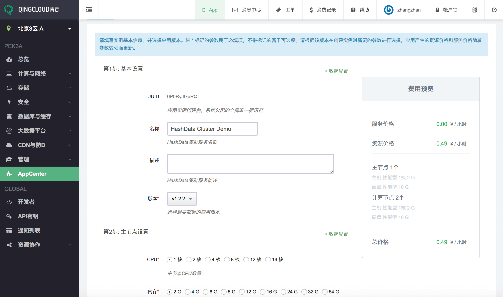
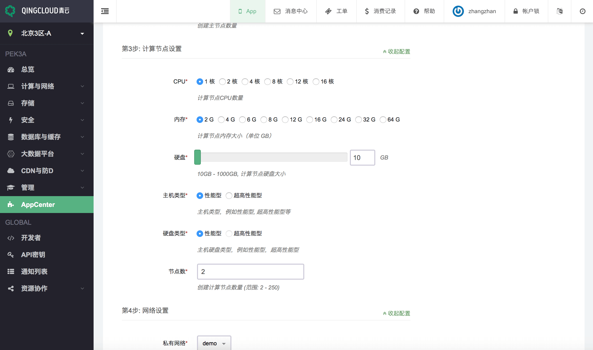
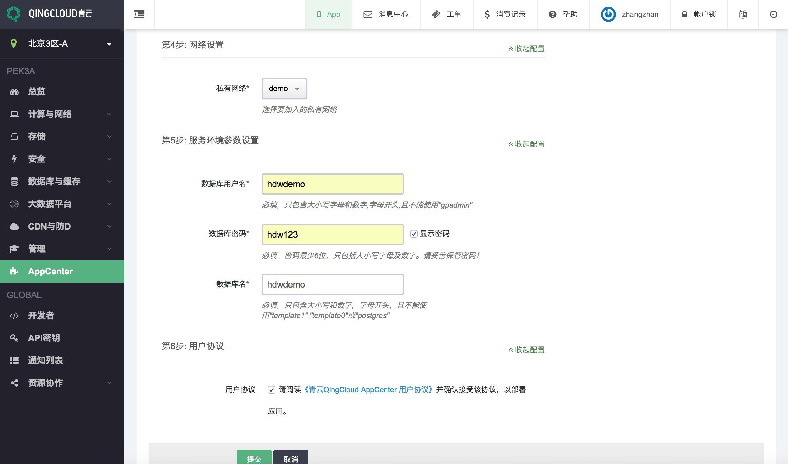
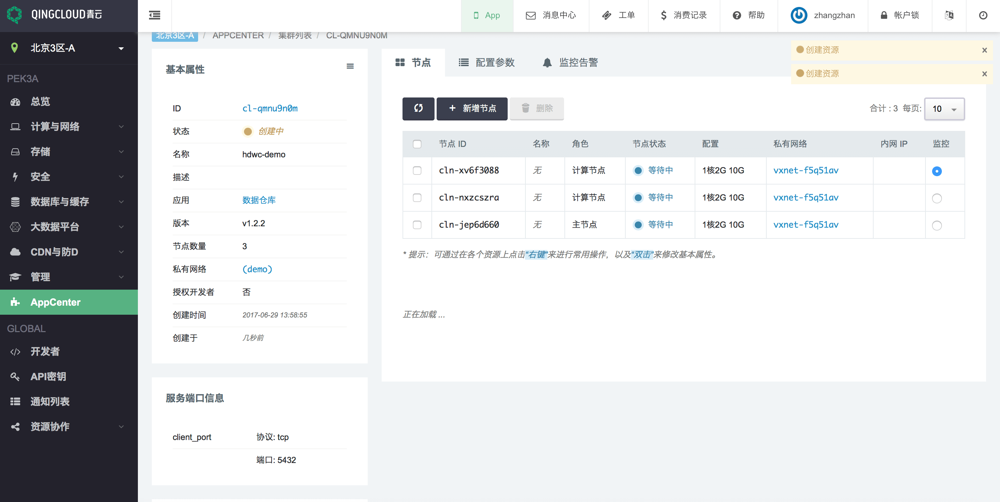
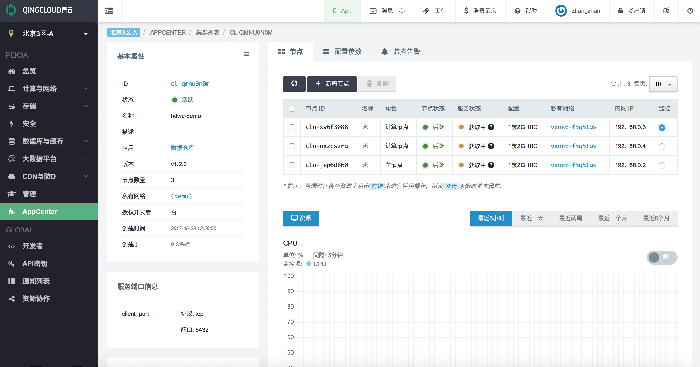

# 步骤2: 启动 HashData 数据仓库样例集群

完成上面的前提步骤后，现在你能够开始启动一个 HashData 数据仓库集群。

## 启动 HashData 数据仓库集群

1. 登陆青云并在应用中心找到对应的产品 [数据仓库(HashData高性能MPP数据仓库)](https://appcenter.qingcloud.com/apps/app-iwacxg9z)。
2. 点击部署到控制台，你可以选择在哪个数据中心创建你的数据仓库集群。在这个教程中，我们选择了北京 3 区。

   > 

3. 创建依赖资源：你需要有一个已连接到 VPC 的私有网络。如果您没有创建好依赖资源，点击创建后，可以按照提示完成下面的步骤：

   > * 创建私有网络：计算机与网络 -> 私有网络，点击创建
   >
   >   > 
   >
   > * 创建 VPC 网络：计算机与网络 -> VPC网络，点击创建
   >
   >   > 
   >
   > * 连接私有网络到 VPC 网络：计算机与网络 -> VPC网络，点击创建完成的VPC网络，将上面创建完成的私有网络添加到VPC中
   >
   >   > 

4. 创建好私有网络后，就可以创建 HashData 数据仓库集群了：

   > * 填写基本配置，选择软件版本
   > * 选择主节点的配置
   >
   >   > 
   >
   > * 选择计算节点的配置和数量
   >
   >   > 
   >
   > * 选择之前创建的私有网络
   >
   > * 设置数据库用户名，数据库密码以及初始数据库名字
   >
   > * 阅读用户协议
   >
   >   > 

5. 配置完以上参数，阅读并勾取用户协议，点击创建后，新的集群将会在几分钟之内创建完毕。下图是系统创建时的状态：

   > 

6. 在 AppCenter 控制面板中，选择新创建的集群并且查看集群状态信息。在你连接数据仓库之前，一定要确认集群的状态是可用的，并且数据库的健康状态是正常。

   > 