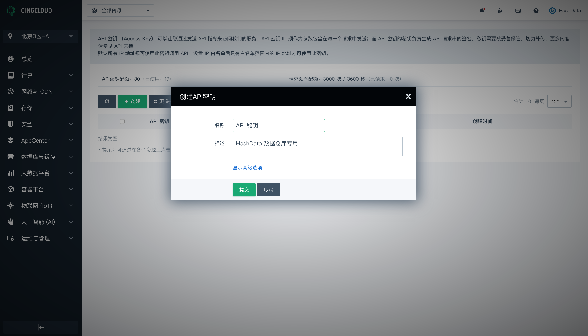
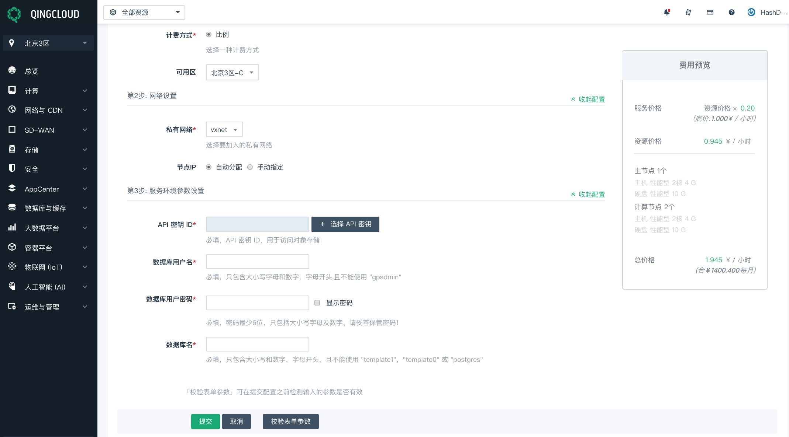

# 步骤2: 启动 HashData 数据仓库样例集群

完成上面的前提步骤后，现在你能够开始启动一个 HashData 数据仓库集群。

## 启动 HashData 数据仓库集群

1. 建议用户创建 HashData 数据仓库专用的 API 秘钥. 创建API 秘钥的功能菜单位于青云控制台的右上角，个人账户信息页面。

 > 
 
 如果您已经有创建好 API 秘钥，可以跳过此步，示例中我们设置一个 demo 密钥,注意 demo 只是演示的示例名称并不代表密钥本身。
   
   > 
   
   通过点击“下载”按钮，可以取得私钥，此下载链接将保留10分钟。为了保障您的安全，这是获取API私钥的唯一途径，请及时下载并妥善保管您的私钥
   
   > 

2. 登陆青云并在应用中心找到对应的产品 [数据仓库(HashData高性能MPP数据仓库)](https://appcenter.qingcloud.com/apps/app-iwacxg9z)。

3. 点击部署到控制台，您可以选择在哪个数据中心创建你的数据仓库集群。在这个教程中，我们选择了北京3区A。

   > 

4. 填写基本信息，同时您可以根据实际需求选择资源配置类型，目前包括标准版，企业版，自定义版本。标准版定义为 HashData 数据仓库集群的最小配置，开发测试或者小规模部署可以选择标准版，企业版适用于大多数生产环境。另外用户可以按需进行自定义集群配置。

   > 

5. 创建依赖资源：你需要有一个已连接到 VPC 的私有网络。如果您没有创建好依赖资源，点击创建后，可以按照提示完成下面的步骤，如果你已经有一个可用的私有网络，可以跳过此步：

   > * 创建私有网络：计算机与网络 -> 私有网络，点击创建
   >
   >   > 
   >
   > * 创建 VPC 网络：计算机与网络 -> VPC网络，点击创建
   >
   >   > 
   >
   > * 连接私有网络到 VPC 网络：计算机与网络 -> VPC网络，点击创建完成的VPC网络，将上面创建完成的私有网络添加到VPC中
   >
   >   > 

6. 设置私有网络，你可以选择具体的私有网络，同时根据实际情况选择自动分配和手动指定节点 IP, 我们选择自动分配方式为您演示。当前缺省的私有网络名称为 vxnet0
   
   > 

7. 配置服务环境参数，你可以在青云设置自己的API密钥，密钥是访问对象存储期间使用的，结合实际情况创建对应数据库用户名，密码及其设置数据库名，最后完成提交操作。

   > 

8. 点击提交后，会显示如下信息内容，请耐心等待

   > 

   在 AppCenter 控制面板中，选择新创建的集群并且查看集群状态信息。在你连接数据仓库之前，一定要确认集群的状态是可用的，并且数据库的健康状态是正常

   > 

9. 在 AppCenter 控制面板对应配置参数位置，有您之前通过 API 密钥功能下载生成的密钥信息，以及对应的密钥私钥，请妥善保管密钥安全性，点击修改属性，您可以去修改对应 API 密钥参数属性信息
