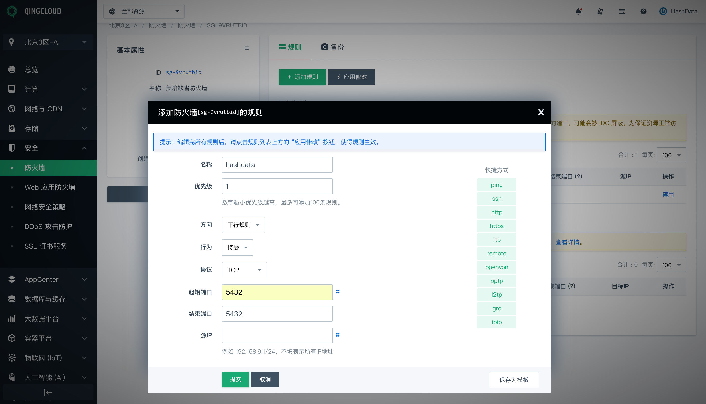
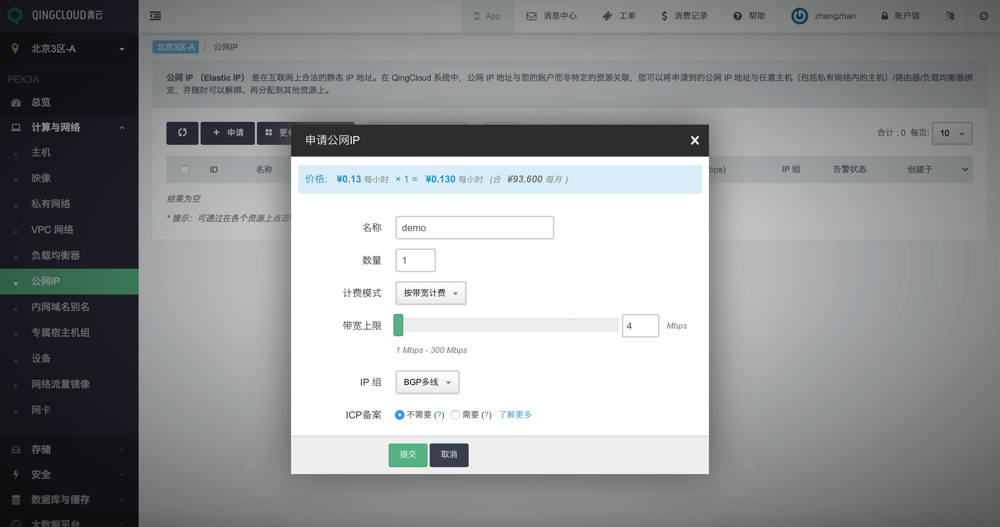
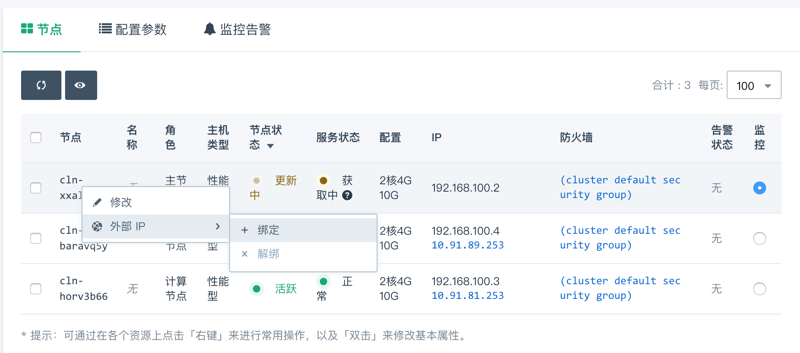

# 步骤3: 授权连接样例集群

在前面的步骤中，你已经创建启动了你的 HashData 数据仓库集群。在你连接到数据仓库集群之前，你需要对上一步骤中创建的路由器进行相应的配置。

## 防火墙配置

在路由器的详情页面，点击选用的防火墙进入其详情页面，添加一条打开 5432 端口的下行规则，如下所示：

这条下行规则允许你的 SQL 客户端工具能够访问路由器的 5432 端口。

## 配置公网 IP 

如果你的 SQL 客户端不在青云的网络里，你还需要申请一个公网 IP 地址，并绑定到数据仓库集群的主节点。从云内部访问 HashData 数据仓库集群不需要绑定公网 IP。

将公网 IP 绑定到数据仓库：

