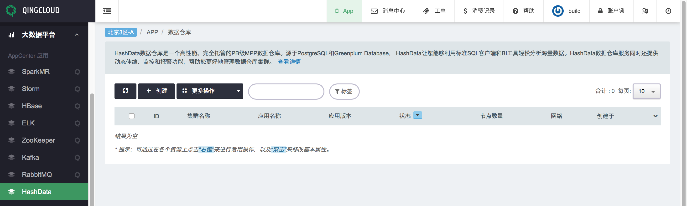
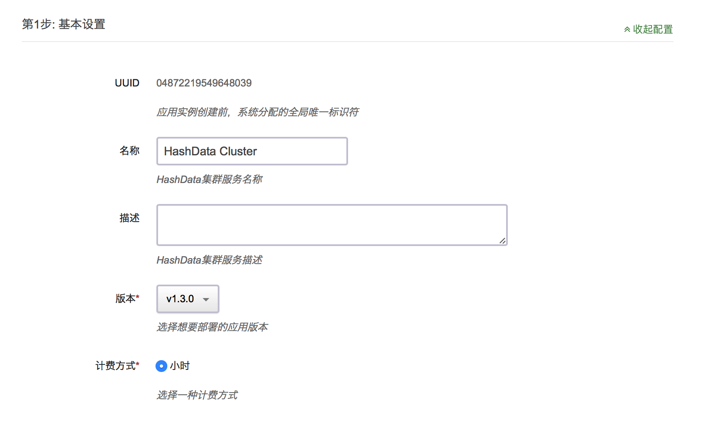
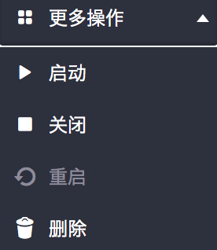
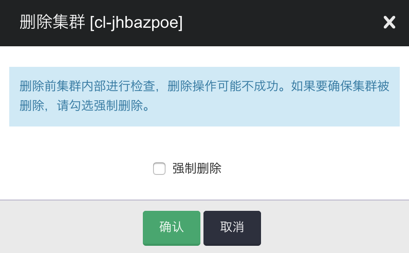

# 管理概述

HashData 数据仓库服务将管理所有与数据仓库创建、运维和扩容相关的工作。这些任务包括了准备计算和存储资源，监控和备份集群，以及对引擎打补丁和升级。

## 集群管理

一个 HashData 数据仓库集群由一组节点组成。这些节点中包括一个 master-node 和一个或者多个 segment-node。你应该根据你的数据集大小和查询的复杂度以及数量来选择需要的计算节点类型和数量。

HashData 数据仓库服务有几个与集群访问和安全相关的功能。

一个数据仓库是一个集群，由一组称为 segment-node 的计算资源组成。每个数据仓库集群包含一个  HashData 数据仓库引擎和一个或多个数据库。

## 集群和节点

一个 HashData 数据仓库集群由一组节点组成。每个集群包含一个 master-node 和一个或多个 segment-node。master-node 接受来自客户应用的查询，解析查询，以及生成执行计划。然后，master-node 调度和协调 segment-node 并行执行查询计划，汇总中间结果，然后将最终结果返回给客户应用。segment-node 执行查询计算并且相互间传递数据来完成查询。中间结果将发送到 master-node 进行汇总聚合，然后由 master-node 返回给客户应用。更多关于 master-node 和 segment-node 的细节，请参考《开发指南》的 [HashData 数据仓库架构]() 章节。

## 扩容和缩容

当你创建初始集群后，如果你需要对它的存储和性能进行改变的话，你可以对集群进行扩容和缩容。你可以以增删节点的方式对集群进行横向扩容和缩容。另外，你也可以以改变每个节点的计算资源（CPU数量和内存大小）和存储资源（硬盘空间大小）的方式对集群进行纵向扩容和缩容。

## 选择数据中心

HashData 数据仓库已经在多个数据中心上线。当你选择了某个数据中心去创建一个 HashData 数据仓库集群，组成该集群的所有节点都将在同一个数据中心里。

## 关闭和删除集群

当你希望暂停集群运行和产生新费用的时候，你可以选择将集群关闭。对于关闭的集群，下次你需要使用的时候，可以将它重新启动。如果你的集群和存在数据仓库里面的数据都不需要了，你可以选择删除整个集群。

## 集群状态

集群状态反应了集群的当前状态。下面的表格详细描述了每种集群状态。

| 状态 | 说明 |
| :--- | :--- |
| 活跃 | 服务正在运行，并且可用 |
| 等待中 | 创建 HashData 数据仓库请求已经提交了，排队等待创建。 |
| 创建中 | 正在创建 HashData 数据仓库服务。 |
| 关闭中 | 关闭服务时的状态，服务正在关闭。 |
| 已关闭 | 服务已经关闭。 |
| 删除中 | 删除服务时的状态，服务正在被删除。 |
| 已删除 | 集群删除后，在回收站的状态。 |
| 更新中 | 集群删除后，在回收站的状态。 |
| 已废弃 | 扩容或缩容后，旧集群将进入废弃状态。如果您验证新集群没有问题后，可以将“已废弃”集群直接删除。 |

## 通过控制台管理集群

你可以通过控制台来创建、修改、删除数据仓库集群，以及对集群进行扩容和缩容。

#### 创建集群

目前 HashData 数据仓库已经在青云的第三方应用商店上线。您可以根据您的使用需求选择不同配置类型和节点数量。

| 推荐场景 | CPU 数量 | 内存 | 适合场景 |
| :--- | :--- | :--- | :--- |
| 体验版 | 1 个 | 2GB | 学习和了解 HashData 数据仓库功能和特性，复杂查询可能由于内存不足而无法正常运行 |
| 标准版 | 4 个 | 8GB |  数据规模较小，POC 原型，开发。中等数据量的复杂、并发 查询。 |
| 企业版 | 12 个 | 24GB | 大规模数据处理，对处理速度和时间有较高要求。 |

存储说明：

| 存储类型 | 详细说明 |
| :--- | :--- |
| 性能型 | 普通 SATA 存储 |
| 超高性能版 | SSD 磁盘 |

**你可以通过如下步骤创建一个集群**：

1. 登录青云控制台 [https://console.qingcloud.com/login](https://console.qingcloud.com/login) ,选择 **HashData** 服务：  
   

2. 在数据仓库汇总页面上，点击 **创建** 按钮：  
   

3. 提供集群配置信息：  
   
   
   
   

   * **名称**： HashData 数据仓库集群的名称，方便您管理集群。
   * **CPU**：选择 CPU 内核数量。
   * **内存**：选择内存大小。
   * **硬盘**：选择数据盘的大小，根据需求调整。
   * **主机类型**：即磁盘 IO 类型。
   * **硬盘类型**：磁盘 IO 的类型，与主机类型相对应。
   * **节点数**：主节点数只能为 1，计算节点数量可以选择 2 ~ 250 之间的整数值。
   * **私有网络**：选择集群所在的私有网络。
   * **节点IP**：可以选择自动分配，也可以手工指定各个节点的 IP 。
   * **数据库用户名**：数据库超级用户用户名。必填，只包含大小写字母和数字,字母开头,且不能使用"gpadmin"
   * **数据库密码**：数据库超级用户密码。必填，密码最少6位，只包括大小写字母及数字。请妥善保管密码！
   * **数据库名**：初始数据库名称。必填，只包含大小写和数字，字母开头，且不能使用 "template1","template0" 或 "postgres"

   **注意**： HashData 数据仓库提供了计算节点计算能力升降级和节点数量的增加和减少，因此您可以按需的逐渐扩大集群的规模，避免在需求较少时，仍然付出较高的价格。

#### 关闭或删除集群

如果你不在需要你的集群了，你可以选择关闭或者删除这个集群。

**删除或停止集群：**

1. 登录青云控制台 [https://console.qingcloud.com/login](https://console.qingcloud.com/login)  ,选择 **HashData** 服务：  
   
   

2. 在数据库仓库汇总页面，查看要关闭或删除的集群：  
   
   

3. 可以在要关闭或删除的集群名称上，点击右键，将会看到下面的菜单：  
   
   

4. 要一次关闭或停止多个集群，可以通过复选框来勾选需要关闭或停止的集群，然后点击 **更多操作** 按钮，来进行操作：  
   
   

5. 点击关闭操作后，将会弹出提示框：  
   
   

6. 点击删除操作后，将会弹出确认框：  
   
   
   
   * 非强制停止：当没有勾选强制停止时，停止操作会将正在运行的查询回滚，并通知所有连接的客户端服务器关闭。
   * 强制停止：勾选强制停止后，集群的所有进行都会被杀死，再下一次启动时，数据库需要进行恢复操作（启动速度将会变慢）。除非您非常迫切的需要停止服务，否则我们不建议您使用此操作。

7. 集群关闭后，状态将会变成 **已关闭**。

8. 集群删除后，将会从汇总页面移除。

#### 集群扩容和缩容

如果在您首次创建集群后，存储或性能需求发生了改变，您可以通过增加或减少节点，对集群进行扩容或缩容。除此之外，您还能够通过指定不同的 segment-node 类型来提升或降低 segment-node 的计算能力。

例如：您可以增加更多节点，改变节点的类型。当然，您必须注意选择的最终的集群需要能够容纳当前集群的的所有数据，否则在您尝试调整集群规模时，将会得到错误提示。

下面为您简单介绍扩容或缩容的流程：

1. 当您开始扩容或缩容操作时，HashData 数据仓库会重新启动源集群。重启操作将会导致所有连接到集群的连接断开。所有正在执行的事务将会回滚。
2. 源集群在只读模式下重新启动。当集群处于只读模式时，您只能执行读操作。
3. HashData 数据仓库会根据您的需求创建一个新的集群（目标集群），并将数据从源集群拷贝到目标集群。
4. 当扩容或缩容操作将要完成时，源集群将会停止并进入废弃状态。而目标集群的 master-node 将会得到旧集群的 IP 并开始正常工作。此时，所有连接到旧集群的连接将会断开。
5. 在扩容或缩容操作完成后，您就可以正常的访问新集群，并执行读写操作。

当您扩容或缩容时，集群将一直处于只读模式直到操作结束。扩容或缩容的时间主要取决于每个节点上的数据存储量。通常情况下，扩容或缩容的过程一般需要持续几小时到一天。当然如果集群数据量非常大，可能需要花费更长的时间。这是因为数据需要从源集群的节点并行的拷贝到目标集群的节点上。要了解更多关于缩容和扩容的信息，请参考：[横向扩容缩容教程](#横向扩容缩容教程)。

扩容或缩容后的 master-node 节点 IP 在 VPC 网络中不会改变。如果您绑定了公网的 IP，那么弹性 IP 地址会自动绑到新的集群 master-node 上。
