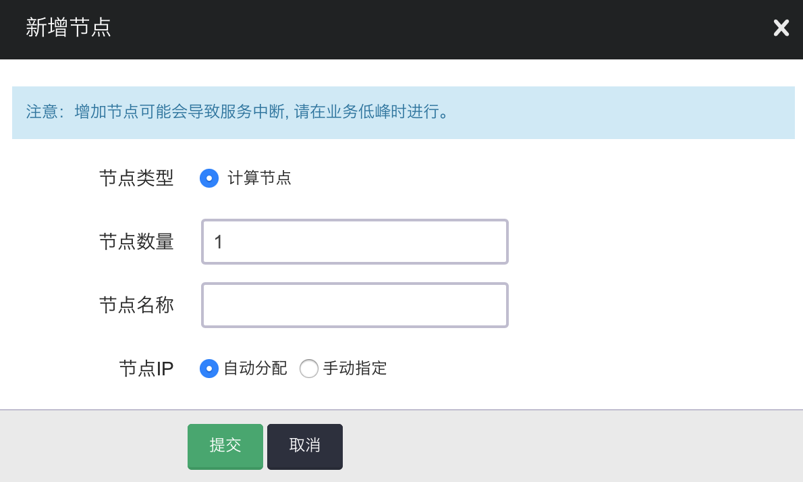
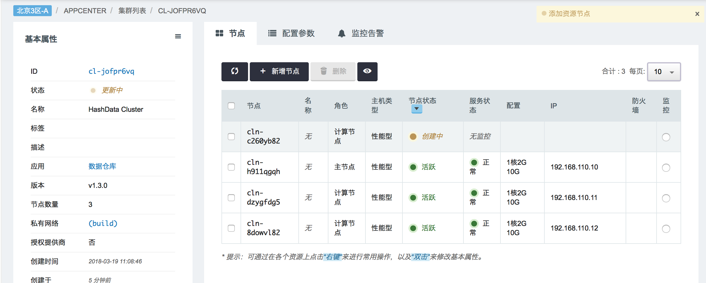
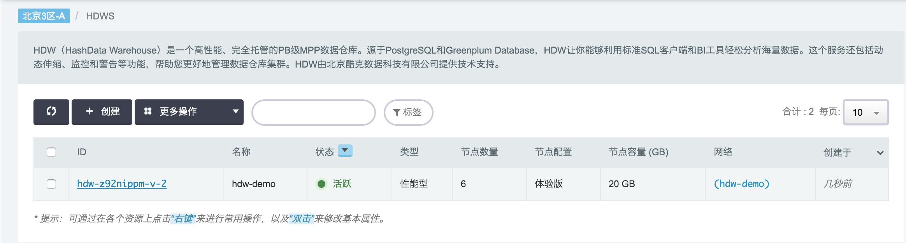
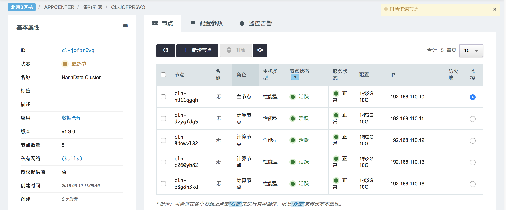
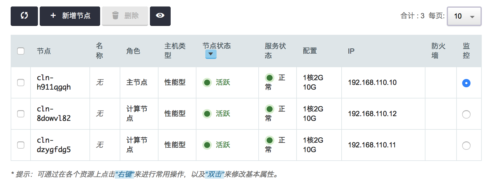

# 扩容和缩容

## 概述

随着您的数据仓库容量和性能需求的变化或增长，您可以通过调整集群的规模，以最优的方式利用 HashData 数据仓库提供的计算和存储资源。您可以通过改变集群的节点数量来扩展或收缩。或者，您还可以选择不同的节点来行来加强或减弱节点的能力。

您可以在集群的详细信息中，添加或删除节点。增加节点和删除节点时，数据将会重新分布到新的集群中。

## 横向扩容缩容

在您需要调整节点数量时，扩容和缩容操作是最便捷的方案。在调整集群节点数量时，您的数据将会在新集群的 segment-node 之间进行重分布。扩容或缩容的时间开销取决于数据总量以及两个集群的最小节点数量。根据数据量的不同，时间可能是从几小时到几天。

当您启动扩容或缩容操作时，集群会进行数据重分布。在这个过程中，不会影响集群的使用，但是建议不要进行数据插入更新等操作，以免影响集群的数据重分布进程。

要了解 HashData 数据仓库集群的扩容或缩容教程，请参考：[横向扩容教程](#1)。

## <h2 id="1"> 横向扩容缩容教程

**扩容**：

1. 在数据仓库汇总页面，点击要进行扩容的集群进入集群详细信息页面：  
   

2. 点击 **增加节点** 按钮，填写要增加的节点数量，并点击继续：  
   

   * **节点数量**：填写要增加的节点数量。
   * **节点名称**：填写要增加的节点名称。
   * **节点IP**：选择新增节点的 IP 生成方式。

3. 数据仓库在进行扩容时，将会进行集群中数据的重分布。您可以在集群详细信息中，看到集群的状态：  
   

4. 扩容结束后，集群中节点的状态就会变为“正常”，至此集群就可以正常使用了：  
   

**缩容**：

1. 在数据仓库汇总页面，点击要进行缩容的集群进入集群详细信息页面：  
   

2. 在集群详细信息页面，勾选需要删除的节点，然后点击 **删除** 按钮：  
   

3. 数据仓库在进行缩容时，将会进行数据重分布。您可以在集群详细信息中，看到集群的状态：  
   

4. 缩容结束，集群状态更新完毕之后，就可以正常使用集群了：  
   

