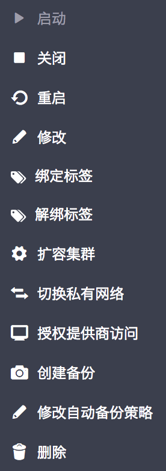
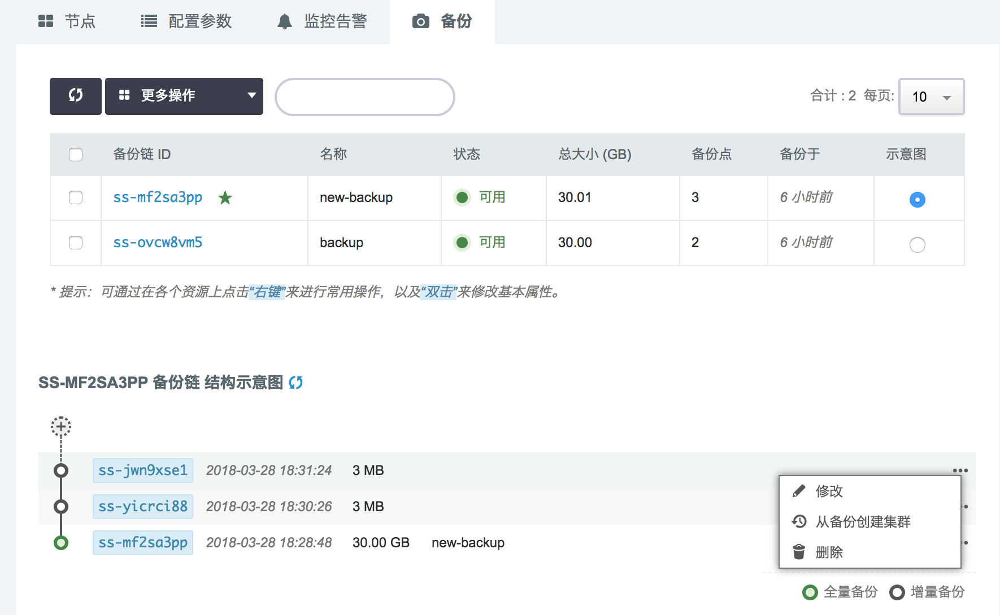
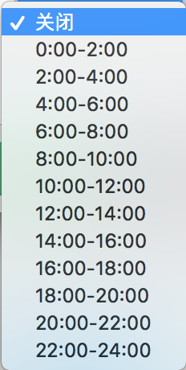

# 集群备份

## 概述
HashData 数据仓库服务支持数据备份和恢复。为了数据安全，您可以对数据进行备份，数据备份包括全量备份和增量备份。

##备份
你可以通过以下步骤创建集群备份

1. 在集群详情页面，点击创建备份
	

2. 在弹出框填写备份名称，第一次备份会创建备份链，备份链为全量备份。备份默认为增量备份，会在最新的备份链创建增量备份。
	

***注意调整集群硬盘大小后，第一次备份是全量备份***

##恢复
你可以通过以下步骤对备份进行恢复操作

1. 集群支持恢复操作，在集群详情页面的备份标签页下，可以从任意备份链的任意备份点进行恢复操作
	

2. 经过上步操作，将跳转到集群创建页面，设置配置信息创建集群
	

##删除备份
删除备份包括删除增量备份和全量备份，备份点指增量备份。由于备份占用存储资源，为了减少费用支出，可以在做好最新备份后，删除之前的集群备份。

1. 删除备份链
	

2. 删除备份链或备份点,删除备份点会把备份点之后的备份一并删除
	

##设置定时备份

你可以通过以下操作设置定时备份

1. 在集群详情页面点击“修改自动备份策略”
	

2. 选择集群需要备份的时间段

	

