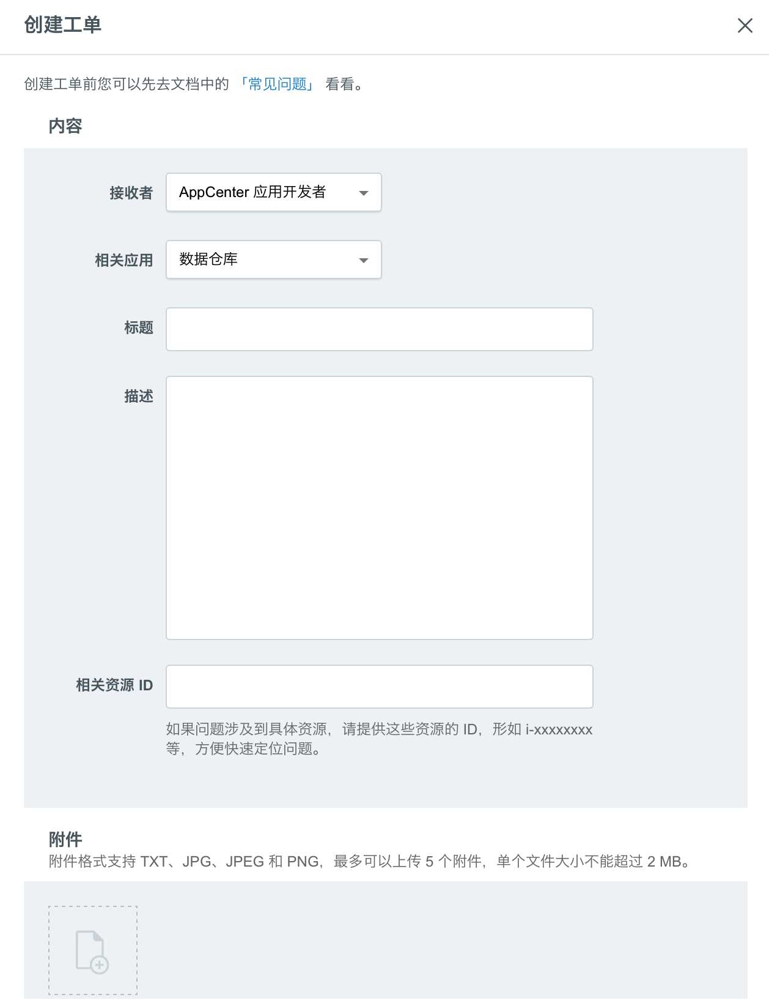

# 排查系统问题

如果您在使用  HashData 数据仓库 过程中遇到任何问题，欢迎通过应用页中（下图所示）的“创建工单”联系我们。  


同时， HashData 数据仓库 作为一个自服务的 PaaS 产品，提供多种系统信息，让您能够自己排查系统问题，加快问题解决速度。

## 查看数据库活动情况

您可以从以下三方面检查数据库状态：

* 活跃的会话（工作负载）
* 锁（竞争）
* 系统资源使用

### 检查活跃的会话

系统视图 _pg\_stat\_activity _提供活跃会话的信息，每行记录对应一个活跃的会话。这些信息包括数据库的 OID，数据库名字，服务器进程的 PID，用户的 OID，用户名字，当前的查询语句，当前查询开始时间，当前服务器进程启动时间，客户端地址，和端口号。为了获取关于当前工作负载最详细的信息，建议您以超级用户的角色去查询这个系统视图。例如：

```
=>SELECT * FROM pg_stat_activity;
```

> 注意：这些信息不是实时更新的。

### 检查锁

系统视图 _pg\_locks _允许您查看关于正在使用中的锁的信息。如果一个事务拿着一把对应某个对象的锁，那么其它所有需要访问那个对象的查询必须等待这把锁被释放后才能继续往前执行。从用户的角度看，这种现象就像查询被挂起了。

通过检查那些还没被授予的锁，我们能够对不同数据库客户端会话之间的竞争情况有所了解。pg\_locks 提供了这个数据库系统全局的锁信息，而不仅仅局限于当前数据库。您可以将锁信息与表（仅限于当前数据库中的表）进行关联，从而了解哪些表正处于竞争状态；您也可以锁信息与 _pg\_stat\_activity_ 进行关联，从而了解哪些客户端会话拿着锁或者正在等待锁。例如：

```
=> SELECT locktype, database, c.relname, l.relation,
   l.transactionid, l.transaction, l.pid, l.mode, l.granted,
   a.current_query
   FROM pg_locks l, pg_class c, pg_stat_activity a
   WHERE l.relation=c.oid AND l.pid=a.procpid
   ORDER BY c.relname;
```

### 检查系统资源使用

您可以通过上面提到的 节点物理资源监控数据来检查系统资源使用情况，包括CPU，内存，磁盘I/O和网络I/O，从而判断当前系统的性能瓶颈，如当前查询是计算密集型的还是I/O密集型的。

## 取消或中断后台操作

有些情况下，您之前提交的查询运行了很长时间还没有结束，于是想把查询取消了。除了可以通过在客户端发取消信号（如CTRL＋C）外，您还可以通过内置信号函数给服务器后台进程发送取消或者中断信号，从而将查询取消。通过检查活跃的会话我们可以得到查询对应的后台进程 PID，然后通过 pg\_cancel\_backend\(pid int\) 和 pg\_terminate\_backend\(pid int\) 给 pid 对应的后台进程发送 SIGINT 或者 SIGTERM 信号，从而取消或者中断相应的查询。
