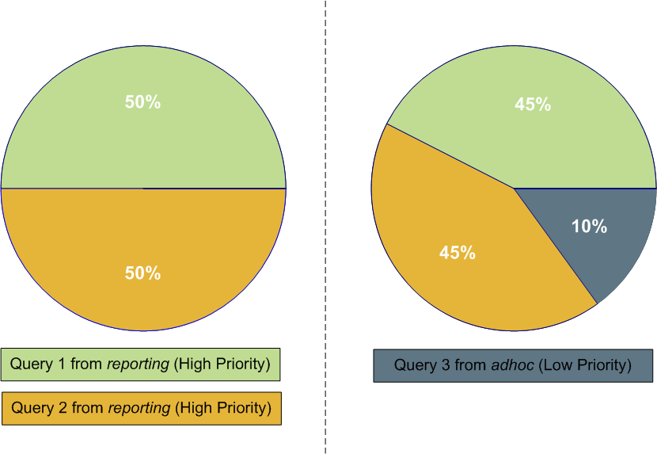
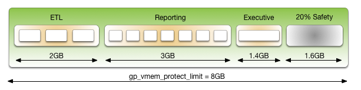

# 使用资源队列进行工作负载管理

使用 HashData 数据库工作负载管理根据业务需求为查询分配优先级并分配资源，并防止资源不可用时启动查询。

本节介绍 HashData 数据库工作负载管理，并说明如何使用资源队列来管理资源。使用资源队列，可用内存和 CPU 资源可以分配给在您的 HashData 数据库系统上执行的不同类型的查询。您可以限制并发查询的数量，用于执行查询的内存量以及用于处理查询的相对 CPU 数量。

主要的资源管理问题是可以同时执行的查询的数量以及分配给每个查询的内存量。在不限制并发和内存使用的情况下，不可能保证可接受的性能。内存是最有可能限制系统处理能力的资源。因此，我们从 HashData 数据库内存使用概述开始。

## HashData 数据库内存使用概述

内存是 HashData 数据库系统的关键资源，高效使用内存可确保高性能和高吞吐量。本主题介绍如何在 segment 之间分配 segment 主机内存以及管理员可用于配置内存的选项。

HashData 数据库 segment 主机运行多个 PostgreSQL 实例，全部共享主机的内存。 每个 Segment 具有相同的配置，并行处理查询时同时消耗相似数量的内存，CPU 和磁盘 IO。

为了获得最佳查询吞吐量，应该仔细管理内存配置。HashData 数据库中的每个级别都有内存配置选项，从操作系统参数到管理具有资源队列的工作负载，以及设置分配给单个查询的内存量。

### segment 主机内存

在 HashData Segment 主机上，可用主机内存在计算机上执行的所有进程之间共享，包括操作系统， HashData  数据库 Segment 实例和其他应用程序进程。管理员必须确定 HashData  数据库和非 HashData  数据库进程共享主机的内存，并配置系统高效地使用内存。监控内存使用情况同样重要，以检测 HashData  数据库或其他进程占用主机内存的任何变化。

下图说明了如何在 HashData  数据库 Segment 主机上使用内存。

##### 图1.  HashData  数据库 Segment 主机内存


从图中的底部开始，标有 A 的线表示总的主机内存。在 A 行之上的行显示了总的主机内存包括物理 RAM 和交换空间。

标记为 B 的行显示可用的总内存必须由 HashData 数据库和主机上的所有其他进程共享。非 HashData  数据库进程包括操作系统和任何其他应用程序，例如系统监视代理程序。某些应用程序可能会占用相当大一部分内存，因此可能需要调整每个 HashData  数据库主机的 Segment 数量或每个 Segment 的内存量。

Segment（C）分别获得 HashData  数据库内存（B）的相同份额。

在一个 Segment 中，资源队列控制着如何分配内存来执行 SQL 语句。资源队列允许您将业务需求转换为您的 HashData 数据库系统中的执行策略，并防范可能降低性能的查询。

非管理用户向 HashData  数据库系统提交的每个语句都与一个资源队列相关联。队列确定是否允许语句执行，并且在资源可用时允许执行。该语句可能被拒绝，立即执行，或在资源可用时排队执行。

您可以为不同类型的查询创建资源队列，并为每个队列保留一段固定的 Segment 内存。或者，您可以设置一个服务器配置参数，以指定为每个查询分配多少内存，并且不对资源队列设置最大内存限制。

查询优化器产生一个查询执行计划，由一系列称为运算符的任务（图中标为 D ）组成。操作员执行诸如表扫描或连接之类的任务，并且通常通过处理一组或多组输入行来生成中间查询结果。操作者收到资源队列分配给查询的内存份额。如果操作员不能在分配给它的内存中执行所有的工作，它会将数据缓存在磁盘上的溢出文件中。

### 配置 segment 主机内存的选项

主机内存是 Segment 主机上所有应用程序共享的总内存。主机内存的数量可以使用以下任何一种方法进行配置：

* 向节点添加更多的 RAM 以增加物理内存。
* 分配交换空间来增加虚拟内存的大小。
* 设置内核参数 vm.overcommit\_memory 和 vm.overcommit\_ratio 来配置操作系统如何处理大内存分配请求。

物理 RAM 和 OS 配置通常由平台团队和系统管理员进行管理。

要为操作系统和其他进程保留的内存量与工作负载有关。操作系统内存的最低建议是 32 GB ，但是如果 HashData 数据库中有很多并发，则可能需要增加到 64 GB 的预留内存。操作系统内存最大的用户是 SLAB，随着 HashData 数据库并发性和使用的套接字数量的增加，SLAB 也随之增加。

vm.overcommit\_memory 内核参数应始终设置为 2， HashData 数据库的唯一安全值。

vm.overcommit\_ratio 内核参数设置用于应用程序进程的 RAM 的百分比，其余部分为操作系统保留。红帽的默认值是 50（50％）。将此参数设置得太高可能导致操作系统保留的内存不足，从而导致 Segment  主机故障或数据库故障。将设置保留为默认值 50 通常是安全的，但保守。将该值设置得过低会减少可以同时运行的并发性和查询复杂性，这是通过减少可用于 HashData 数据库的内存量来实现的。增加 vm.overcommit\_ratio 时记住总是为操作系统活动保留一些内存是非常重要的。

计算 vm.overcommit\_ratio 的安全值，首先确定可用于 HashData 数据库进程的总内存 gp\_vmem ，用这个公式：

```
gp_vmem = ((SWAP + RAM) – (7.5GB + 0.05 * RAM)) / 1.7
```

SWAP 是主机上的交换空间以 GB 为单位，RAM 是安装在主机上的 RAM 的数量以 GB 为单位。

使用下面的公式计算 vm.overcommit\_ratio 的值：

```
vm.overcommit_ratio = (RAM - 0.026 * gp_vmem) / RAM
```

### 配置 HashData 数据库内存

HashData 数据库内存是所有 HashData 数据库 segments 实例可用的内存量。

设置 HashData 数据库集群时，需要确定每个主机要运行的 primary Segment 的数量以及要为每个 Segment 分配的内存量。根据 CPU 内核，物理内存量和工作负载特征，Segment 数通常是介于 4 和 8 之间的值。启用 Segment Mirror 后，设置为按照在失败期间主机上执行的 Primary Segment 的最大数量分配内存非常重要。例如，如果使用默认分组镜像配置，则 Segment 主机故障会使发生故障的主机的镜像所在的主机上的 Primary Segment 数量加倍。将每个主机的镜像分布在多个其他主机上的镜像配置可以降低最大值，允许为每个 Segment 分配更多的内存。例如，如果使用块镜像配置（每个块有 4 个主机，每个主机有 8 个 Primary Segment ），则单个主机故障将导致块中的其他主机最多有 11 个活动的 primaries，而默认的分组镜像则为 16 个。

gp\_vmem\_protect\_limit 值是分配给每个 Segment 的总的内存。通过计算可用于所有 HashData 数据库进程的内存并除以故障期间主要分区的最大数量来估计。如果 gp\_vmem\_protect\_limit 设置得太高，查询可能会失败。使用以下公式来计算 gp\_vmem\_protect\_limit 的安全值。

计算 gp\_vmem ，可用于所有 HashData 数据库进程的内存，使用以下公式：

```
gp_vmem =（（SWAP + RAM） - （7.5GB + 0.05 * RAM））/1.7
```

SWAP 是主机上的交换空间以 GB 为单位，RAM 是安装在主机上的 RAM 的数量以 GB 为单位。

使用下面的公式计算 gp\_vmem\_protect\_limit 的值：

```
gp_vmem_protect_limit = gp_vmem / max_acting_primary_segments
```

max\_acting\_primary\_segments 是由于主机或 Segment 故障而激活 Segment 镜像时，主机上可能运行的 Primary segments 的最大数量。

另一个重要的 HashData 数据库服务器配置参数是 statement\_mem。此参数设置分配给执行查询的最大内存量。要确定此参数的值，请将每个 Segment 的内存量（ gp\_vmem\_protect\_limit ）减去 10％ 安全余量乘以您希望同时执行的最大查询数。默认的 HashData 数据库资源队列允许最多 20 个并发查询。以下是计算 statement\_mem 的公式：

```
(gp_vmem_protect_limit * .9 ) / max_expected_concurrent_queries
```

资源队列允许更大程度地控制为查询分配的内存量。详细信息请参阅 [配置工作负载管理](#配置工作负载管理)。

## 使用资源队列管理工作负载的概述

资源队列是管理 HashData 数据库系统中并发程度的主要工具。资源队列是用你 CREATE RESOURCE QUEUE SQL 语句创建的数据库对象。您可以使用它们来管理可能同时执行的活动查​​询的数量，每种查询分配的内存量以及查询的相对优先级。资源队列还可以防范会消耗太多资源并降低整体系统性能的查询。

每个数据库角色都与一个资源队列相关联;多个角色可以共享相同的资源队列。角色可以使用 CREATE ROLE 或 ALTER ROLE 的 RESOURCE QUEUE 表达式标注。如果未指定资源队列，则角色与默认资源队列关联， pg\_default。

当用户提交执行查询时，将根据资源队列的限制来评估查询。如果查询不会导致队列超过其资源限制，那么该查询将立即运行。如果查询导致队列超出其限制（例如，如果当前正在使用活动语句插槽的最大数目），则查询必须等到队列资源空闲后才能运行。查询按照先进先出的原则进行评估。如果启用了查询优先级，则会定期评估系统上的活动工作负载，并根据查询优先级重新分配处理资源。拥有超级用户属性的用户免受资源队列限制。超级用户查询总是立即运行，而不管其分配的资源队列施加的限制。

##### 图2.资源队列进程



资源队列定义具有相似资源需求的查询的类。管理员应该为组织中的各种类型的工作负载创建资源队列。例如，您可以为以下类查询创建资源队列，对应于不同的服务级别协议：

* ETL 查询
* 报告查询
* 执行查询

资源队列具有以下特征：

MEMORY\_LIMIT：在队列（每个 Segment）中的所有查询使用的总的内存。例如，在 ETL 队列上设置 MEMORY\_LIMIT 为 2GB，允许 ETL 查询在每个 segment 上面使用最大为 2GB 的内存。

ACTIVE\_STATEMENTS：一个队列的插槽数量；一个队列的最大并发级别。当所有的插槽都被使用，新的查询必须等待。默认情况下每个查询使用相同大小的内存。例如，pg\_default 资源队列有如下配置 ACTIVE\_STATEMENTS = 20。

PRIORITY：查询的相对 CPU 使用率。可能是一下的几个级别之一：LOW, MEDIUM, HIGH, MAX。默认级别为 MEDIUM。查询优先级机制监视系统中运行的所有查询的 CPU 使用情况，并调整 CPU 的使用情况以符合其优先级。例如，你可以设置 MAX 优先级给执行资源队列， MEDIUM 优先级给其它的队列，以确保执行查询可以获取更多的 CPU 资源。

MAX\_COST：查询计划成本限制。HashData 数据库优化器为每个查询分配一个数字成本。如果成本超过了为资源队列设置的 MAX\_COST 值，查询会因为太昂贵被拒绝。

> 注意：使用 MEMORY\_LIMIT 和 ACTIVE\_STATEMENTS 为资源队列设置限制比 MAX\_COST 更好。

HashData 数据库系统的默认配置有一个名为 pg\_default 的单个默认资源队列。pg\_default 资源队列有一个 ACTIVE\_STATEMENTS 设置 20，没有 memory\_limit 的，中等优先，没有设置  MAX\_COST。这意味着所有的查询都被立即接受和运行，并且具有相同的优先级并且没有内存限制。但是，只有 20 个查询可以同时执行。

资源队列允许的并发查询数取决于 memory\_limit 的参数设置：

* 如果资源队列没有设置 MEMORY\_LIMIT，每个查询分配的内存量就是 statement\_mem 这个服务器配置参数的值。资源队列可以使用的最大内存是 statement\_mem 与 ACTIVE\_STATEMENTS 的乘积。
* 当在资源队列上设置了 MEMORY\_LIMIT ，队列可以同时执行的查询数受限于队列的可用内存。

被分配给系统的查询被分配一定数量的内存，并为其生成查询计划树。树的每个节点都是一个运算符，如排序或散列连接。每个运算符都是一个单独的执行线程，并被分配到总体语句内存的一小部分，至少为 100KB。如果计划中有大量的操作符，则操作员所需的最小内存可能会超过可用内存，并且查询将被拒绝，报内存不足的错误。操作员确定他们是否可以在分配的内存中完成任务，或者是否必须将数据泄漏到磁盘上的工作文件中。分配和控制每个操作员使用的内存量的机制称为内存配额。

并非所有通过资源队列提交的 SQL 语句都根据队列限制进行评估。默认情况下，只有 SELECT, SELECT INTO, CREATE TABLE AS SELECT,  DECLARE CURSOR 语句被评估。如果服务器配置参数 resource\_select\_only 被设置为关闭，则 INSERT, UPDATE, DELETE 也将被评估。

另外，一个在执行期间运行的 SQL 语句 EXPLAIN ANALYZE 命令被排除在资源队列之外。

### 资源队列示例

默认的资源队列，pg\_default，最多允许 20 个活动查询并为每个分配相同数量的内存。对于生产系统来说，这通常不是适当的资源控制。为确保系统满足性能预期，可以定义查询类并将其分配给资源队列，这些资源队列被配置为使用最适合于该类查询的并发性，内存和 CPU 资源执行它们。

下图显示了 HashData 数据库系统的示例资源队列配置， gp\_vmem\_protect\_limit 被设置为 8GB：

图3.资源队列配置示例



本示例具有三类具有不同特征和服务级别协议（ SLA ）的查询。为它们配置了三个资源队列。segment 存储器的一部分被保留为安全余量。

| Resource Queue | Active Statements | Memory Limit | Memory per Query |
| :--- | :--- | :--- | :--- |
| ETL | 3 | 2GB | 667MB |
| Reporting | 7 | 3GB | 429MB |
| Executive | 1 | 1.4GB | 1.4GB |

分配给队列的总内存是 6.4GB，或者是由内存定义的总分区内存的 80％ gp\_vmem\_protect\_limit 服务器配置参数。允许 20％ 的安全余量容纳一些已知使用比由资源队列分配的更多内存的运算符和查询。

### 内存限制如何工作

在资源队列上设置 MEMORY\_LIMIT  ，即为此资源队列提交的所有活动的查询在一个 Segment 实例上可以占用的最大的内存量。分配给每个查询的内存量是队列内存限制除以活动语句限制。（将内存限制与基于活动语句的队列结合使用，而不是基于成本的队列）。例如，如果队列的内存限制为 2000MB，活动语句限制为 10，则通过队列提交的每个查询默认情况下将分配 200MB 的内存。默认的内存分配可以在每个查询上使用 statement\_mem 服务器配置参数覆盖（最大为队列内存限制）。一旦查询已经开始执行，它就会将分配的内存保存在队列中，直到完成为止，即使在执行期间它实际上消耗的内存量少于分配的内存量。

你可以使用 statement\_mem 服务器配置参数来覆盖当前资源队列设置的内存限制。在会话级别，您可以增加 statement\_mem 直到资源队列的 memory\_limit 值。这将允许单个查询使用为整个队列分配的所有内存，而不会影响其他资源队列。

statement\_mem 的值的使用上限是 max\_statement\_mem 配置参数（超级用户参数）。对于在设置了 memory\_limit 的资源队列中的查询，statement\_mem 的最大值为 min\(MEMORY\_LIMIT，max\_statement\_mem\)  MEMORY\_LIMIT，max\_statement\_mem 两个参数的最小值。当查询被允许时，从 memory\_limit 中减去分配给它的内存。如果 memory\_limit 耗尽，即使 ACTIVE\_STATEMENTS 没有达到最大值，同一资源队列中的新查询也必须等待。请注意，这只能发生在 statement\_mem 覆盖资源队列分配的内存。

例如，考虑一个名为 adhoc 的资源队列特别指定使用以下设置：

* memory\_limit 是 1.5GB
* ACTIVE\_STATEMENTS 是 3

默认情况下每个提交到队列中的语句都会被分配 500 MB 的内存。现在考虑下面一系列的时间：

1. ADHOC\_1 提交了一个 Q1 查询，覆盖 STATEMENT\_MEM 到 800MB。Q1 语句被允许进去系统。
2. ADHOC\_2 提交了一个 Q2 查询，使用默认的 500MB。
3. Q1 和 Q2 在运行的同时，ADHOC3 提交 Q3 查询，使用默认的 500 MB。

Q1 和 Q2 查询使用了队列的 1500MB 中的 1300MB。因此 Q3 在运行之前必须等待 Q1 或 Q2 完成。

如果资源队列没有设置 MEMORY\_LIMIT，直到 ACTIVE\_STATEMENTS 限定的所有插槽都被使用之前查询都被允许进入系统，并且每个查询都可以被设置为任意高的 statement\_mem。这可能会导致资源队列使用超量的内存。

### Priorities 如何工作

该优先资源队列的设置不同于 memory\_limit 和 ACTIVE\_STATEMENTS 这些设置决定了一个查询是否会被允许进入队列并最终执行。该优先设置在查询生效后适用于查询。活动查询共享可用 CPU 资源，由其资源队列的优先级设置确定。当来自高优先级队列的语句进入正在运行的语句组时，它可能会声明可用 CPU 的更大份额，从而减少分配给具有较低优先级设置的队列中已经运行的语句的份额。

查询的相对大小或复杂度不会影响 CPU 的分配。如果一个简单，低成本的查询与一个庞大而复杂的查询同时运行，并且它们的优先级设置是相同的，那么它们将被分配相同的可用 CPU 资源份额。当新的查询变为活动状态时，CPU 份额将被重新计算，但同​​等优先级的查询将仍然具有相同数量的 CPU。

例如，管理员创建三个资源队列： adhoc 提交由业务分析正在进行的查询，reporting 定期的汇报工作， executive 对执行用户角色提交的查询。管理员希望确保定期的报告作业不受特别分析师查询的不可预测资源需求的严重影响。此外，管理员希望确保由执行角色提交的查询分配了 CPU 的重要份额。

相应地，资源队列优先级设置如下所示：

* _adhoc_
  * 低优先级
* _reporting_
  * 高度优先
* _executive_
  * 最高优先级

在运行时，活动语句的 CPU 份额由这些优先级设置确定。如果来自报告队列的查询 1 和 2 同时运行，则它们具有相同的 CPU 份额。当一个 adhoc 查询变为活动状态时，它宣称 CPU 的份额较小。报告查询使用的确切份额是经过调整的，但由于其优先级设置相同而保持不变：

#### 图4.根据优先级重新调整 CPU 份额


> 注意：这些插图中显示的百分比是近似值。高，低和最高优先级队列之间的 CPU 使用率并不总是精确地按照这些比例进行计算。

当执行查询进入运行语句组时，会调整 CPU 使用情况以考虑其最大优先级设置。与分析和报告查询相比，这可能是一个简单的查询，但是在完成之前，它将占用最大的 CPU 份额。

#### 图5.为最大优先级查询重新调整的  CPU  份额


## 启用工作负载管理的步骤

在 HashData 数据库中启用和使用工作负载管理涉及以下高级任务：

1. 配置工作负载管理。
2. 创建资源队列并对其设置限制。
3. 为一个或多个用户角色分配一个队列。
4. 使用工作负载管理系统视图来监视和管理资源队列。 

## 配置工作负载管理

安装 HashData 数据库时默认启用资源调度，并且对于所有角色都是必需的。默认的资源队列，pg\_default，具有 20 的有效语句限制，没有内存限制和中等优先级设置。为各种类型的工作负载创建资源队列。

### 配置工作负载管理

1. 以下参数用于资源队列的一般配置：
   * max\_resource\_queues
     * 设置资源队列的最大数量。
   * max\_resource\_portals\_per\_transaction
     * 设置每个事务允许同时打开的游标的最大数量。请注意，打开的游标将在资源队列中保存一个活动的查询槽。
   * resource\_select\_only
     * 如果设置为 on，则 SELECT, SELECT INTO, CREATE TABLE AS SELECT, DECLARE CURSOR 命令会被评估。如果设置为 off ，则 INSERT, UPDATE,  DELETE 命令也会被评估。
   * resource\_cleanup\_gangs\_on\_wait
     * 在资源队列中占用一个插槽之前清除空闲的 Segment 工作进程。
   * stats\_queue\_level
     * 启用对资源队列使用情况的统计信息收集，然后通过查询 pg\_stat\_resqueues 系统视图来查看。
2. 以下参数与内存利用率有关：

   * gp\_resqueue\_memory\_policy

     * 启用 HashData 数据库内存管理功能。在 HashData 中，分配算法 eager\_free 利用了并非所有操作员同时执行的事实。查询计划分为多个阶段， HashData 数据库在该阶段执行结束时热切地释放分配给前一阶段的内存，然后将急切释放的内存分配给新阶段。当设置为 auto 时，查询内存的使用被 statement\_mem 和资源队列的内存限制控制。

   * statement\_mem 和 max\_statement\_mem

     * 用于在运行时为特定查询分配内存（覆盖由资源队列分配的默认分配）。max\_statement\_mem 由数据库超级用户设置，以防止常规数据库用户过度分配。

   * gp\_vmem\_protect\_limit

     * 设置所有查询进程可以使用的上限，不应超过 Segment 主机的物理内存量。当一个 Segment 主机在查询执行过程中达到此限制时，导致限制超出的查询将被取消。

   * gp\_vmem\_idle\_resource\_timeout 和 gp\_vmem\_protect\_segworker\_cache\_limit

     * 用于释放空闲数据库进程所在的 Segment 主机上的内存。管理员可能希望在具有大量并发性的系统上调整这些设置。

   * shared\_buffers

     * 设置 HashData 服务器实例用于共享内存缓冲区的内存量。该设置必须至少为 128 kb，至少为 MAX\_CONNECTIONS 的 16kb 倍。该值不得超过操作系统共享内存最大分配请求大小。

3. 以下参数与查询优先级有关。  
   请注意，以下参数都是本地参数，这意味着它们必须设置在 master 和所有 segments 的 postgresql.conf 文件中：

   * gp\_resqueue\_priority
     * 默认情况下启用查询优先级排序功能。
   * gp\_resqueue\_priority\_sweeper\_interval
     * 设置所有活动语句的 CPU 使用率重新计算的时间间隔。对于典型的数据库操作，此参数的缺省值应该足够了。
   * gp\_resqueue\_priority\_cpucores\_per\_segment

     * 指定每个 Segment 实例分配的 CPU 内核数量。master 和 segment 的默认值是 4。
     每个主机检查自己的 postgresql.conf 中该参数的值。应该将其设置为反映 CPU 核心比率较高的值。例如，在每个主机有 10 个 CPU 内核，每个主机有 4 个 segments 的集群上，您可以指定 master 和 Standby master 上面 gp\_resqueue\_priority\_cpucores\_per\_segment 的值为 10。通常，只有 master 实例在 Master 主机上。segment 主机上面参数值为 2.5。如果参数值设置不正确，则 CPU 可能没有被充分利用，或者查询优先级可能无法正常工作。例如，如果 HashData 数据库集群在您的 Segment 主机上每个 CPU 核心的 Segment 实例少于一个，请确保相应地调整此值。实际的 CPU 内核利用率基于 HashData 数据库并行查询的能力和执行查询所需的资源。

     > 注意：任何可用于操作系统的 CPU 内核都包含在 CPU 内核数量中。例如，虚拟 CPU 核心包含在 CPU 核心的数量中。

4. 如果您希望查看或更改任何工作负载管理参数值，则可以使用 gpconfig 实用程序。

5. 例如，要查看特定参数的设置：

   ```
   $ gpconfig --show gp_vmem_protect_limit
   ```

6. 例如，要在所有的 segments 实例上设置一个值，并在 master 设备上设置一个不同的值：

   ```
   $ gpconfig -c gp_resqueue_priority_cpucores_per_segment -v 2 -m 8
   ```

7. 重新启动 HashData 数据库以使配置更改生效：

   ```
   $ gpstop -r
   ```

## 创建资源队列

创建资源队列包含给它一个名字，设置一个活动的查询限制，并且可选地在资源队列上设置一个查询优先级。使用 CREATE RESOURCE QUEUE 命令来创建新的资源队列。

### 创建具有活动查询限制的队列

资源队列与一个 ACTIVE\_STATEMENTS 设置限制可以由分配给该队列的角色执行的查询的数量。例如，要创建一个名为 adhoc 的资源队列，其活动查询限制为 3：

```
=# CREATE RESOURCE QUEUE adhoc WITH (ACTIVE_STATEMENTS=3);
```

这意味着，对于分配给 adhoc 资源队列的所有角色，在任何给定的时间，系统上只能运行三个活动查询。如果此队列有三个查询正在运行，并且第四个查询由该队列中的某个角色提交，那么该查询必须等待，直到某个插槽可以运行。

### 创建具有内存限制的队列

资源队列与一个 memory\_limit 的设置控制通过队列提交的所有查询的内存量。总内存不应该超过每个 Segment 可用的物理内存。设置 memory\_limit 到每个 Segment 可用内存的 90％。例如，如果主机具有 48GB 的物理内存和 6 个 Segments 实例，则每个 Segment 实例的可用内存为 8GB 。你可以计算推荐的 memory\_limit 的对于单个队列为 0.90 \* 8 = 7.2 GB。如果系统上创建了多个队列，则其总内存限制也必须合计为 7.2 GB。

与 ACTIVE\_STATEMENTS 一起使用时，每个查询分配的默认内存量是： memory\_limit/ACTIVE\_STATEMENTS 。与 MAX\_COST 一起使用时，每个查询分配的默认内存量是：MEMORY\_LIMIT \*（query\_cost/MAX\_COST）。使用 memory\_limit 的和 ACTIVE\_STATEMENTS 结合，而不是与 MAX\_COST。

例如，要创建一个具有 10 的活动查询限制和 2000MB 总内存限制的资源队列（每个查询将在执行时分配 200MB 的 Segment 主机内存）：

```
=# CREATE RESOURCE QUEUE myqueue WITH (ACTIVE_STATEMENTS=20, MEMORY_LIMIT='2000MB');
```

默认的内存分配可以在每个查询上使用 statement\_mem 服务器配置参数覆盖，前提是 memory\_limit 或 max\_statement\_mem 没有超过。例如，要为特定的查询分配更多的内存：

```
=> SET statement_mem='2GB';
=> SELECT * FROM my_big_table WHERE column='value' ORDER BY id;
=> RESET statement_mem;
```

作为一般指导，对于所有资源队列的 MEMORY\_LIMIT 的总值，不应超过 Segment 主机的物理内存量。如果工作负载在多个队列上错开，那么超额订阅内存分配可能是可以的。

### 设置优先级

为了控制资源队列对可用 CPU 资源的消耗，管理员可以分配适当的优先级。当高并发性导致 CPU 资源争用时，与高优先级资源队列相关联的查询和语句将声明比低优先级查询和语句更大的可用 CPU 份额。

优先级设置是使用 CREATE RESOURCE QUEUE  WITH 和 ALTER RESOURCE QUEUE WITH 命令的 WITH 参数创建和修改的。例如，要为 adhoc 和 reporting 队列指定优先级设置，管理员将使用以下命令：

```
=# ALTER RESOURCE QUEUE adhoc WITH (PRIORITY=LOW);
=# ALTER RESOURCE QUEUE reporting WITH (PRIORITY=HIGH);
```

要创建具有最高优先级的 executive 队列，管理员将使用以下命令：

```
=# CREATE RESOURCE QUEUE executive WITH (ACTIVE_STATEMENTS=3, PRIORITY=MAX);
```

当启用查询优先级功能时，如果没有明确分配则资源队列被赋予一个 MEDIUM 优先级。

> 重要提示：为了在活动的查询工作负载上强制执行资源队列优先级，您必须通过设置关联的服务器配置参数来启用查询优先级排序功能。

## 将角色（用户）分配给资源队列

一旦创建资源队列，您必须将角色（用户）分配到其适当的资源队列。如果角色没有明确分配给资源队列，他们将转到默认资源队列， pg\_default 。默认资源队列具有 20 的活动语句限制，没有成本限制和中等优先级设置。

使用 ALTER ROLE 或者 CREATE ROLE 命令将角色分配给资源队列。例如：

```
=# ALTER ROLE name RESOURCE QUEUE queue_name;
=# CREATE ROLE name WITH LOGIN RESOURCE QUEUE queue_name;
```

角色只能在任何给定时间分配给一个资源队列，因此您可以使用 ALTER ROLE 命令来初始分配或更改角色的资源队列。

资源队列必须按用户分配。如果您有角色层次结构（例如，组级角色），则将资源队列分配给该组不会传递给该组中的用户。

超级用户总是免除资源队列限制。超级用户查询将始终运行，而不管在其分配的队列上设置的限制。

### 从资源队列中删除角色

所有用户必须分配给一个资源队列。如果未明确分配给特定队列，则用户将进入默认资源队列， pg\_default 。如果您希望从资源队列中删除角色并将其放入默认队列，请将角色的队列分配更改为 none。例如：

```
=# ALTER ROLE role_name RESOURCE QUEUE none;
```

## 修改资源队列

资源队列创建完成后，您可以使用 ALTER RESOURCE QUEUE 命令更改或者重置队列限制。您可以使用 DROP RESOURCE QUEUE 命令删除资源队列。要更改分配给资源队列的角色（用户），请将角色（用户）分配给资源队列。

### 改变资源队列

ALTER RESOURCE QUEUE 命令更改资源队列的限制。要更改资源队列的限制，请为队列指定新值。例如：

```
=# ALTER RESOURCE QUEUE adhoc WITH (ACTIVE_STATEMENTS=5);
=# ALTER RESOURCE QUEUE exec WITH (PRIORITY=MAX);
```

要将活动语句或内存限制重置为无限制，请输入值 -1。要将最大查询成本重置为无限制，请输入值 -1.0。例如：

```
=# ALTER RESOURCE QUEUE adhoc WITH (MAX_COST=-1.0, MEMORY_LIMIT='2GB');
```

你可以使用 ALTER RESOURCE QUEUE 命令来更改与资源队列关联的查询的优先级。例如，要将队列设置为最低优先级：

```
ALTER RESOURCE QUEUE webuser WITH (PRIORITY=MIN);
```

### 删除资源队列

DROP RESOURCE QUEUE 命令删除资源队列。要删除一个资源队列，队列不能分配任何角色，也不能在队列中存在任何等待语句。删除资源队列：

```
=# DROP RESOURCE QUEUE name;
```

## 检查资源队列状态

检查资源队列状态涉及以下任务：

* [查看排队的语句和资源队列状态](#查看排队的语句和资源队列状态)
* [查看资源队列统计信息](#查看资源队列统计信息)
* [查看分配给资源队列的角色](#查看分配给资源队列的角色)
* [查看资源队列的等待查询](#查看资源队列的等待查询)
* [从资源队列中清除等待语句](#从资源队列中清除等待语句)
* [查看主动语句的优先级](#查看主动语句的优先级)
* [重置活动语句的优先级](#重置活动语句的优先级)

### 查看排队的语句和资源队列状态

gp\_toolkit.gp\_resqueue\_status 视图允许管理员查看工作负载管理资源队列的状态和活动。它显示了有多少查询正在等待运行，以及在特定的资源队列中当前有多少查询在系统中处于活动状态。要查看在系统中创建的资源队列，其限制属性及其当前状态：

```
=# SELECT * FROM gp_toolkit.gp_resqueue_status;
```

### 查看资源队列统计信息

如果要跟踪资源队列的统计信息和性能，可以启用资源队列的统计信息收集。这是通过设置在 master 服务器中的 postgresql.conf 文件中的以下服务器配置参数完成的：

```
stats_queue_level = on
```

一旦启用，您可以使用 pg\_stat\_resqueues 系统视图查看关于资源队列使用情况的统计信息。请注意，启用此功能会造成轻微的性能开销，因为必须跟踪通过资源队列提交的每个查询。启用资源队列上的统计信息以进行初始诊断和管理规划可能会很有用，然后禁用该功能以继续使用。

### 查看分配给资源队列的角色

要查看分配给资源队列的角色，请在 pg\_roles 和 gp\_toolkit.gp\_resqueue\_status 系统目录表上执行以下查询：

```
=# SELECT rolname, rsqname FROM pg_roles, 
          gp_toolkit.gp_resqueue_status 
   WHERE pg_roles.rolresqueue=gp_toolkit.gp_resqueue_status.queueid;
```

您可能希望创建此查询的视图以简化将来的查询。例如：

```
=# CREATE VIEW role2queue AS
   SELECT rolname, rsqname FROM pg_roles, pg_resqueue 
   WHERE pg_roles.rolresqueue=gp_toolkit.gp_resqueue_status.queueid;
```

那么你可以查询视图：

```
=# SELECT * FROM role2queue;
```

### 查看资源队列的等待查询

当一个插槽用于资源队列时，它被记录在 pg\_locks 系统目录表中。这是您可以查看所有资源队列的所有当前活动和等待查询的位置。要检查正在队列中的语句（即使是没有等待的语句），也可以使用 gp\_toolkit.gp\_locks\_on\_resqueue 视图。例如：

```
=# SELECT * FROM gp_toolkit.gp_locks_on_resqueue WHERE lorwaiting='true';
```

如果这个查询没有返回任何结果，那就意味着在资源队列中没有等待的语句。

### 从资源队列中清除等待语句

在某些情况下，您可能需要清除资源队列中的等待语句。例如，您可能希望删除正在队列中等待但尚未执行的查询。如果执行时间太长，或者在事务中处于空闲状态并占用其他用户所需的资源队列时，您可能还想停止已经启动的查询。要做到这一点，您必须首先确定要清除的语句，确定其进程 ID（pid），然后使用 pg\_cancel\_backend 和进程 ID 结束进程，如下所示。

例如，要查看有关当前在所有资源队列中处于活动状态或正在等待状态的所有语句的处理信息，请运行以下查询：

```
=# SELECT rolname, rsqname, pid, granted,
          current_query, datname 
   FROM pg_roles, gp_toolkit.gp_resqueue_status, pg_locks,
        pg_stat_activity 
   WHERE pg_roles.rolresqueue=pg_locks.objid 
   AND pg_locks.objid=gp_toolkit.gp_resqueue_status.queueid
   AND pg_stat_activity.procpid=pg_locks.pid
   AND pg_stat_activity.usename=pg_roles.rolname;
```

如果这个查询没有返回任何结果，那就意味着资源队列中没有语句。其中包含两条语句的资源队列示例如下所示：

```
rolname | rsqname |  pid  | granted |     current_query      | datname 
----------------------------------------------------------------------- 
  sammy | webuser | 31861 | t       | <IDLE> in transaction  | namesdb
  daria | webuser | 31905 | f       | SELECT * FROM topten;  | namesdb
```

使用此输出来标识要从资源队列中清除的语句的进程标识（pid）。要清除语句，您需要打开一个终端窗口（使用数据库超级用户 gpadmin 或者系统用户 root），并取消相应的进程。例如：

```
=# pg_cancel_backend(31905)
```

> 注意：请勿使用 KILL 命令。

### 查看活动语句的优先级

gp\_toolkit 行政模式有一个叫做 gp\_resq\_priority\_statement 的视图，其中列出了目前正在执行的所有语句，并提供优先级，会话 ID 和其他信息。

### 重置活动语句的优先级

超级用户可以使用内置函数 gp\_adjust\_priority\(session\_id, statement\_count, priority\) 调整当前正在执行的语句的优先级。使用此函数，超级用户可以提高或降低任何查询的优先级。例如：

```
=# SELECT gp_adjust_priority(752, 24905, 'HIGH')
```

要获取此函数所需的会话 ID 和语句计数参数，超级用户可以使用 gp\_toolkit 管理模式视图， gp\_resq\_priority\_statement 。从视图中，使用这些值作为函数参数。

* rqpsession 列的值为 session\_id 的值。
* rqpcommand 列的值为 statement\_count 的值。
* rqppriority 列的值为当前的优先级。你可以指定一个字符串的值 MAX, HIGH, MEDIUM,或 LOW 作为优先级。

> 注：gp\_adjust\_priority\(\) 函数只影响指定的语句。后面的语句在同一个资源队列中使用队列的通常分配的优先级来执行。


