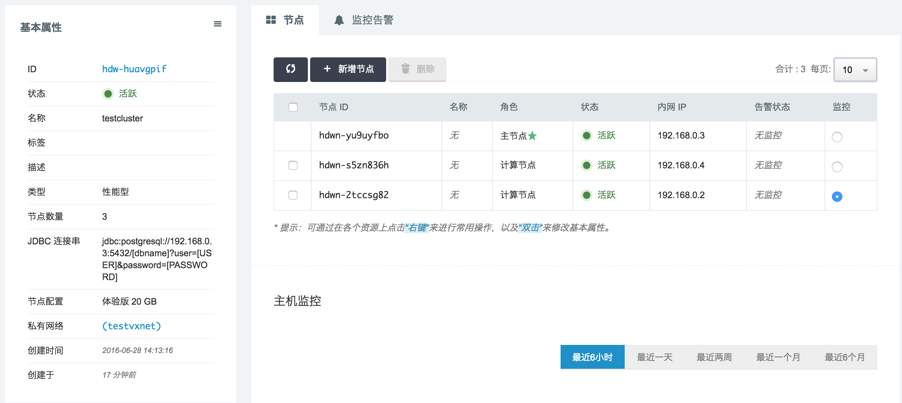

.. include:: ../defines.hrst

.. _cluster_management_guide:

|product-name| 集群管理指南
===========================

欢迎来到 |product-name| 集群管理指南。|product-name| 是一个高性能，完全托管的PB级数据仓库服务。你能够从几百 GB 数据开始，然后根据需要逐步扩容到 1PB 甚至更多，从而在数据中获取对商业和客户的洞悉。

创建数据仓库的第一步是启动一个由一组节点组成的 |product-name| 集群。当你创建的 |product-name| 集群启动后，你可以加载数据，然后执行数据分析查询。无论数据量的大小，|product-name| 让你能够通过基于 SQL 的工具和商业智能应用获得极速的查询性能。

第一次使用 |product-name| ？
----------------------------

如果你是 |product-name| 的初次使用者，我们建议你可以阅读从下面章节开始：

*  :ref:`product_overview`：这个主题提供了 |product-name| 概述。
*  :ref:`getting_started_guide`：遵循这个指南，你将学习如何创建一个数据仓库集群，创建数据库用户表，上传数据和执行测试查询。
*  :ref:`cluster_management_guide` （此文档）：这个指南将教导如何创建和管理 |product-name| 集群。
*  :ref:`developer_guide`：如果你是一个数据库开发者，这个指南将解释如何去设计、创建、查询、和维护组成数据仓库的各个数据库。

.. *  服务亮点和价格：这个产品详情页面提供了 |product-name| 的亮点和收费价格。

你可以通过多种方式来管理你的数据仓库集群。

.. _product_overview:

|product-name| 管理概述
-----------------------

|product-name| 服务将管理所有与数据仓库创建、运维和扩容相关的工作。这些任务包括了准备计算和存储资源，监控和备份集群，以及对引擎打补丁和升级。

集群管理
^^^^^^^^

一个 |product-name| 数据仓库集群由一组节点组成。这些节点中包括一个 |master-node| 和一个或者多个 |segment-node|。你应该根据你的数据大小和查询的复杂度和数量来选择需要的计算节点类型和数量。

.. 集群访问和安全
.. ^^^^^^^^^^^^^^

|product-name| 服务有几个与集群访问和安全相关的功能。

集群
====

概述
----

一个数据仓库是一个集群，由一组称为 |segment-node| 的计算资源组成。每个数据仓库集群包含一个 |product-name| 引擎和一个或多个数据库。

集群和节点
----------

一个 |product-name| 集群由一组节点组成。每个集群包含一个 |master-node| 和一个或多个 |segment-node|。|master-node| 接受来自客户应用的查询，解析查询，以及生成执行计划。然后，|master-node| 调度和协调 |segment-node| 并行执行查询计划，汇总中间结果，然后将最终结果返回给客户应用。|segment-node| 执行查询计算并且相互间传递数据来完成查询。中间结果将发送到 |master-node| 进行汇总聚合，然后由 |master-node| 返回给客户应用。更多关于 |master-node| 和 |segment-node| 的细节，请参考《|devbook|》的 :ref:`dev_architecture` 章节。

扩容和缩容
----------

当你创建初始集群后，如果你需要对它的存储和性能进行改变的话，你可以对集群进行扩容和缩容。你可以以增删节点的方式对集群进行横向扩容和缩容。另外，你也可以以改变每个节点的计算资源（CPU数量和内存大小）和存储资源（硬盘空间大小）的方式对集群进行纵向扩容和缩容。

选择数据中心
------------

|product-name| 已经在多个数据中心上线。当你选择了某个数据中心去创建一个 |product-name| 集群，组成该集群的所有节点都将在同一个数据中心里。

.. 系统维护窗口
.. ------------

.. product-name| 会周期性进行维护，从而对你的集群进行升级。在这些升级过程中，你的集群将进入只读模式。

.. 硬盘空间警告
.. ------------

.. 硬盘空间警告的目的是帮助你监控你的集群存储空间。

关闭和删除集群
--------------

当你希望暂停集群运行和产生新费用的时候，你可以选择将集群关闭。对于关闭的集群，下次你需要使用的时候，可以将它重新启动。如果你的集群和存在数据仓库里面的数据都不需要了，你可以选择删除整个集群。

集群状态
--------

集群状态反应了集群的当前状态。下面的表格详细描述了每种集群状态。

+-------------+----------------------------------------------------------+
|   状态      | 说明                                                     |
+=============+==========================================================+
|   活跃      | 服务正在运行，并且可用                                   |
+-------------+----------------------------------------------------------+
|   等待中    | 创建 |product-name| 请求已经提交了，排队等待创建。       |
+-------------+----------------------------------------------------------+
|   创建中    | 正在创建 |product-name| 服务。                           |
+-------------+----------------------------------------------------------+
|   关闭中    | 关闭服务时的状态，服务正在关闭。                         |
+-------------+----------------------------------------------------------+
|   已关闭    | 服务已经关闭。                                           |
+-------------+----------------------------------------------------------+
|   删除中    | 删除服务时的状态，服务正在被删除。                       |
+-------------+----------------------------------------------------------+
|   已删除    | 集群删除后，在回收站的状态。                             |
+-------------+----------------------------------------------------------+
|   更新中    | 集群删除后，在回收站的状态。                             |
+-------------+----------------------------------------------------------+
|   已废弃    | 扩容或缩容后，旧集群将进入废弃状态。如果您验证新集群没有 |
|             | 问题后，可以将“已废弃”集群直接删除。                     |
+-------------+----------------------------------------------------------+

通过控制台管理集群
------------------

你可以通过控制台来创建、修改、删除数据仓库集群，以及对集群进行扩容和缩容。

创建集群
^^^^^^^^

目前 |product-name| 已经在 |cloud-provider| 的第三方应用商店上线。您可以根据您的使用需求选择不同配置类型和节点数量。

+-------------+----------+------+----------+-----------------------------+
| 节点类型    | CPU 数量 | 内存 | 磁盘数量 | 适合场景                    |
+=============+==========+======+==========+=============================+
| 体验版      |   1 个   |  2GB |   1 块   | 学习和了解 |product-name|   |
|             |          |      |          | 功能和特性，复杂查询可能由  |
|             |          |      |          | 于内存不足而无法正常运行    |
+-------------+----------+------+----------+-----------------------------+
| 标准版      |   4 个   |  8GB |   1 块   | 数据规模较小，POC 原型，开  |
|             |          |      |          | 发。中等数据量的复杂、并发  |
|             |          |      |          | 查询。                      |
+-------------+----------+------+----------+-----------------------------+
| 企业版      |  12 个   | 24GB |   3 块   | 大规模数据处理，对处理速度  |
|             |          |      |          | 和时间有较高要求。          |
+-------------+----------+------+----------+-----------------------------+

存储说明：

+-------------+----------------------------------------------------------+
| 存储类型    | 详细说明                                                 |
+=============+==========================================================+
| 性能型      | 普通 SATA 存储                                           |
+-------------+----------------------------------------------------------+
| 超高性能版  | SSD 磁盘                                                 |
+-------------+----------------------------------------------------------+

价格参考：

+----------+-----------------+-----------------+-----------------+-----------------+-----------------+
| 节点类型 |    2 计算节点   |    4 计算节点   |    8 计算节点   |   16 计算节点   |   32 计算节点   |
+==========+=================+=================+=================+=================+=================+
|  体验版  |  ¥  505.87每月  |  ¥  843.12每月  |  ¥ 1517.62每月  |  ¥ 2866.61每月  |  ¥ 5564.59每月  |
+----------+-----------------+-----------------+-----------------+-----------------+-----------------+
|  标准版  |  ¥ 1954.80每月  |  ¥ 3258.00每月  |  ¥ 5864.40每月  |  ¥11077.20每月  |  ¥21502.80每月  |
+----------+-----------------+-----------------+-----------------+-----------------+-----------------+
|  企业版  |  ¥ 5848.34每月  |  ¥ 9757.22每月  |  ¥17574.98每月  |  ¥33210.50每月  |  ¥64481.54每月  |
+----------+-----------------+-----------------+-----------------+-----------------+-----------------+

**注意1**：最终价格以 |cloud-provider| 控制台显示费用为准。

**注意2**：价格参考中，每块磁盘存储 10GB。体验版和标准版，每个节点配备1块性能型磁盘。企业版每个节点配置3块性能型磁盘。

**注意3**：价格参考是 |product-name| 一个月都在运行计算的，如果您停止 |product-name|，费用将会大幅降低。

另外，除了利用上述表格提供的数据计算数据仓库的费用外，当数据仓库被创建后，像青云其它的云资源一样，您可以通过
总览页面查看数据仓库的费用：

.. image:: ../_static/qingcloud/hdw-charging.png
    :width: 80%

**你可以通过如下步骤创建一个集群**：

#. 登录 |cloud-provider| 控制台 |cloud-mgmt-url|，选择 **数据仓库** 服务：
    .. image:: ../_static/qingcloud/qingcloud-nav.png
        :width: 200px

#. 在数据仓库汇总页面上，点击 **创建** 按钮：
	.. image:: ../_static/qingcloud/main-panel.png
		:width: 100%

#. 提供集群配置信息：
 	.. image:: ../_static/qingcloud/create_10_step1.png
 		:width: 600px

 	* **名称**：|product-name| 集群的名称，方便您管理集群。
 	* **节点数量**：|segment-node| 虚拟机的数量，既是计算能力和存储能力的代表，也是计费的代表。
 	* **类型**：磁盘 IO 的类型。
 	* **节点配置**：|segment-node| 节点虚拟机的计算能力，CPU 和内存。
 	* **存储大小**：|segment-node| 虚拟机的每块磁盘容量。

 	**注意**：|product-name| 提供了计算节点计算能力升降级和节点数量的增加和减少，因此您可以按需的逐渐扩大集群的规模，避免在需求较少时，仍然付出较高的价格。

#. 私有网络配置
	.. image:: ../_static/qingcloud/create_12_step2.png
		:width: 600px

#. 数据仓库用户配置信息
	.. image:: ../_static/qingcloud/create_13_step3.png
		:width: 600px

 	* **数据库名**：初始数据库名称。
 	* **用户名**：数据库超级用户用户名。
 	* **密码**：数据库超级用户密码。

.. 修改集群
.. ^^^^^^^^

.. 你可以修改集群的如下属性：

关闭或删除集群
^^^^^^^^^^^^^^

如果你不在需要你的集群了，你可以选择关闭或者删除这个集群。

**删除或停止集群：**

#. 登录 |cloud-provider| 控制台 |cloud-mgmt-url|，选择 **数据仓库** 服务：
    .. image:: ../_static/qingcloud/qingcloud-nav.png
        :width: 200px

#. 在数据库仓库汇总页面，查看要关闭或删除的集群：
	.. image:: ../_static/qingcloud/node_5_summary.png
		:width: 100%

#. 可以在要关闭或删除的集群名称上，点击右键，将会看到下面的菜单：
	.. image:: ../_static/qingcloud/cluster_summary_menu.png
		:width: 160px

#. 要一次关闭或停止多个集群，可以通过复选框来勾选需要关闭或停止的集群，然后点击 **更多操作** 按钮，来进行操作：
	.. image:: ../_static/qingcloud/cluster_summary_menu_more.png
		:width: 142px

#. 点击停止操作后，将会弹出提示框：
	.. image:: ../_static/qingcloud/stop.png
		:width: 401px

	* 非强制停止：当没有勾选强制停止时，停止操作会将正在运行的查询回滚，并通知所有连接的客户端服务器关闭。
	* 强制停止：勾选强制停止后，集群的所有进行都会被杀死，再下一次启动时，数据库需要进行恢复操作（启动速度将会变慢）。除非您非常迫切的需要停止服务，否则我们不建议您使用此操作。

#. 点击删除操作后，将会弹出确认框：
	.. image:: ../_static/qingcloud/delete.png
		:width: 401px

#. 集群停止后，状态将会变成 **TODO**。

#. 集群删除后，将会从汇总页面移除。

集群扩容和缩容
^^^^^^^^^^^^^^

如果在您首次创建集群后，存储或性能需求发生了改变，您可以通过增加或减少节点，对集群进行扩容或缩容。除此之外，您还能够通过指定不同的 |segment-node| 类型来提升或降低 |segment-node| 的计算能力。

例如：您可以增加更多节点，改变节点的类型。当然，您必须注意选择的最终的集群需要能够容纳当前集群的的所有数据，否则在您尝试调整集群规模时，将会得到错误提示。

下面为您简单介绍扩容或缩容的流程：

#. 当您开始扩容或缩容操作时，|product-name| 会重新启动源集群。重启操作将会导致所有连接到集群的连接断开。所有正在执行的事务将会回滚。
#. 源集群在只读模式下重新启动。当集群处于只读模式时，您只能执行读操作。
#. |product-name| 会根据您的需求创建一个新的集群（目标集群），并将数据从源集群拷贝到目标集群。
#. 当扩容或缩容操作将要完成时，源集群将会停止并进入废弃状态。而目标集群的 |master-node| 将会得到旧集群的 IP 并开始正常工作。此时，所有连接到旧集群的连接将会断开。
#. 在扩容或缩容操作完成后，您就可以正常的访问新集群，并执行读写操作。

当您扩容或缩容时，集群将一直处于只读模式直到操作结束。扩容或缩容的时间主要取决于每个节点上的数据存储量。通常情况下，扩容或缩容的过程一般需要持续几小时到一天。当然如果集群数据量非常大，可能需要花费更长的时间。这是因为数据需要从源集群的节点并行的拷贝到目标集群的节点上。要了解更多关于缩容和扩容的信息，请参考：`横向扩容缩容教程`_。

扩容或缩容后的 |master-node| 节点 IP 在 VPC 网络中不会改变。如果您绑定了公网的 IP，那么弹性 IP 地址会自动帮到新的集群 |master-node| 上。

.. 集群配置信息
.. ^^^^^^^^^^^^

.. 集群状态
.. ^^^^^^^^

.. 硬盘空间警告
.. ^^^^^^^^^^^^

.. 集群性能信息
.. ^^^^^^^^^^^^

.. 访问 |product-name| 集群和数据库
.. ================================

.. 配置 |product-name| 连接
.. ------------------------

.. 通过客户端工具和代码连接到集群
.. ------------------------------

.. 分析解决连接问题
.. ----------------

集群性能监控
============

概述
----

|product-name| 提供了两大类与集群运行状态相关的信息：（1）活跃会话、运行查询等用户级别的信息；（2）节点
（包括主节点和计算节点）的资源使用情况。用户级别的信息，您可以通过 `查看数据库活动情况`_ 中的系统视图获取。
在这一章节中，我们重点看看如何获得节点级别的信息。通过分析这两类数据，您可以判断系统的性能瓶颈在哪个环节，
以及数据仓库集群的类型和大小是否与工作负载相匹配，从而决定是否需要进行横向和纵向的扩缩容。

性能数据概要
------------

目前，|product-name| 提供三类节点物理资源监控数据：

- CPU使用率
- 内存使用率
- 硬盘使用率

节点物理资源监控数据
^^^^^^^^^^^^^^^^^^^^

在数据仓库主控制页面，选择您需要感兴趣的数据仓库集群；进入集群详情页面后，选择需要监控的节点：

    
打开“主机监控”开关，您就能看到节点的物理资源监控数据：

.. image:: ../_static/qingcloud/monitor_info.png
    :width: 80%

.. 用户查询相关监控数据
.. ^^^^^^^^^^^^^^^^^^^^

.. 系统事件和审计日志
.. ==================

.. 系统事件
.. --------

.. 数据库审计日志
.. --------------

扩容和缩容
==========

概述
----

随着您的数据仓库容量和性能需求的变化或增长，您可以通过调整集群的规模，以最优的方式利用 |product-name| 提供的计算和存储资源。您可以通过改变集群的节点数量来扩展或收缩。或者，您还可以选择不同的节点来行来加强或减弱节点的能力。

您可以在集群的详细信息中，添加或删除节点。增加节点和删除节点时，数据将会导入到新的集群中。

横向扩容缩容
------------

在您需要调整节点数量时，扩容和缩容操作是最便捷的方案。在调整集群节点数量时，您的数据将会从源集群的 |segment-node| 直接拷贝到目标集群的 |segment-node|。扩容或缩容的时间开销取决于数据总量以及两个集群的最小节点数量。根据数据量的不同，时间可能是从几小时到几天。

当您启动扩容或缩容操作时，|product-name| 会将源集群置入只读模式，直到节点调整完毕。在这个过程中，您只能运行读取数据库的查询；您不能运行任何向数据库写入的查询。

在 |product-name| 将源集群置入只读模式后，会根据您的集群节点类型和新的节点数量，立即创建一个新的集群，也就是目标集群。然后 |product-name| 从源集群开始将数据拷贝到目标集群。当前面的操作完成后，所有的新客户连接将会转到目标集群。如果您的查询正在运行，您的连接将会中断，您必须重新在目标集群上运行该查询。

.. 支持查看扩容和缩容进度

要了解 |product-name| 集群的扩容或缩容教程，请参考：`横向扩容缩容教程`_。

横向扩容缩容教程
----------------

**扩容**：

#. 在数据仓库汇总页面，点击要进行扩容的集群进入集群详细信息页面：
	.. image:: ../_static/qingcloud/create_16_creating_done.png
		:width: 100%

#. 点击 **增加节点** 按钮，填写要增加的节点数量，并点击继续：
 	.. image:: ../_static/qingcloud/resize_add_node.png
 		:width: 601px

 	**节点数量**：填写要增加的节点数量。

#. 数据仓库在进行扩容时，将会创建一个新的集群，并将数据拷贝到新的集群。您可以在集群详细信息中，看到集群的状态：
 	.. image:: ../_static/qingcloud/resize_2_to_5.png
 		:width: 100%

#. 扩容结束后，新集群将会替代旧集群。旧集群将会进入废弃状态：
 	.. image:: ../_static/qingcloud/node_5_summary.png
 		:width: 100%

**缩容**：

#. 在数据仓库汇总页面，点击要进行缩容的集群进入集群详细信息页面：
	.. image:: ../_static/qingcloud/create_16_creating_done.png
		:width: 100%

#. 在集群详细信息页面，勾选需要删除的节点，然后点击 **删除** 按钮：
	.. image:: ../_static/qingcloud/resize_decrease_selection.png
		:width: 100%

#. 数据仓库在进行缩容时，将会创建一个新的集群，并将数据拷贝到新的集群。您可以在集群详细信息中，看到集群的状态：
	.. image:: ../_static/qingcloud/resize_decreasing.png
		:width: 100%

#. 缩容结束后，新集群将会替代旧集群。旧集群将会进入废弃状态：
	.. image:: ../_static/qingcloud/resize_decrease_done.png
		:width: 100%

排查系统问题
=============

如果您在使用 |product-name| 过程中遇到任何问题，欢迎通过应用页中（下图所示）的“创建工单”联系我们。
    .. image:: ../_static/qingcloud/open_ticket.png
        :width: 80%

同时，|product-name| 作为一个自服务的 PaaS 产品，提供多种系统信息，让您能够自己排查系统问题，加快问题解决速度。

查看数据库活动情况
------------------

您可以从以下三方面检查数据库状态：

- 活跃的会话（工作负载）
- 锁（竞争）
- 系统资源使用

检查活跃的会话
^^^^^^^^^^^^^^^

系统视图 *pg_stat_activity* 提供活跃会话的信息，每行记录对应一个活跃的会话。这些信息包括数据库的OID，数据库名字，服务器进程的PID，
用户的OID，用户名字，当前的查询语句，当前查询开始时间，当前服务器进程启动时间，客户端地址，和端口号。为了获取关于当前工作负载最
详细的信息，建议您以超级用户的角色去查询这个系统视图。例如：

::

    =>SELECT * FROM pg_stat_activity;

注意：这些信息不是实时更新的。

检查锁
^^^^^^^^

系统视图 *pg_locks* 允许您查看关于正在使用中的锁的信息。如果一个事务拿着一把对应某个对象的锁，那么其它所有需要访问那个对象的查询必须等待这把锁
被释放后才能继续往前执行。从用户的角度看，这种现象就像查询被挂起了。

通过检查那些还没被授予的锁，我们能够对不同数据库客户端会话之间的竞争情况有所了解。*pg_locks* 提供了这个数据库系统全局的锁信息，而不仅仅局限于当前
数据库。您可以将锁信息与表（仅限于当前数据库中的表）进行关联，从而了解哪些表正处于竞争状态；您也可以锁信息与 *pg_stat_activity* 进行关联，从而
了解哪些客户端会话拿着锁或者正在等待锁。例如：

.. code-block:: sql

    => SELECT locktype, database, c.relname, l.relation,
       l.transactionid, l.transaction, l.pid, l.mode, l.granted,
       a.current_query
       FROM pg_locks l, pg_class c, pg_stat_activity a
       WHERE l.relation=c.oid AND l.pid=a.procpid
       ORDER BY c.relname;

检查系统资源使用
^^^^^^^^^^^^^^^^

您可以通过上面提到的 `节点物理资源监控数据`_ 来检查系统资源使用情况，包括CPU，内存，磁盘I/O和网络I/O，从而判断当前系统的性能瓶颈，如当前查询
是计算密集型的还是I/O密集型的。

取消或中断后台操作
------------------

有些情况下，您之前提交的查询运行了很长时间还没有结束，于是想把查询取消了。除了可以通过在客户端发取消信号（如CTRL＋C）外，您还可以通过内置信号函数
给服务器后台进程发送取消或者中断信号，从而将查询取消。通过 `检查活跃的会话`_ 我们可以得到查询对应的后台进程PID，然后通过 
pg_cancel_backend(pid int) 和 pg_terminate_backend(pid int) 给 pid 对应的后台进程发送 SIGINT 或者 SIGTERM 信号，从而取消或者中断
相应的查询。
